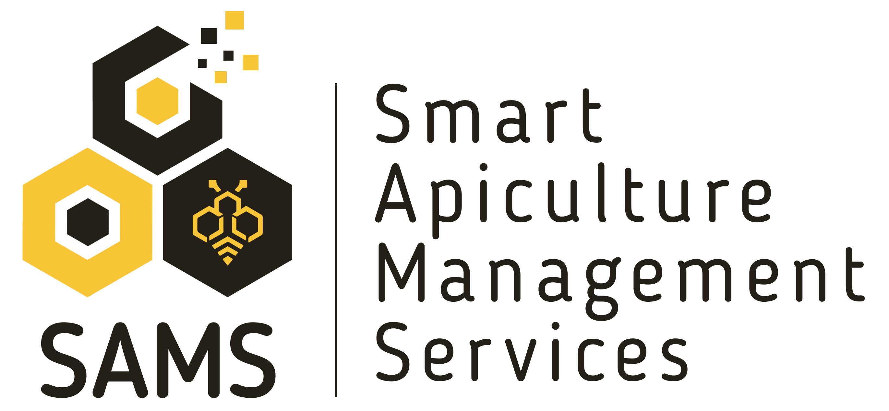
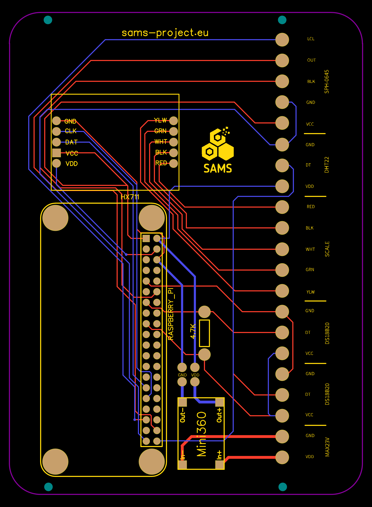

# SAMS Project

### Beehive monitoring software for Raspberry Pi
Software for running a Raspberry Pi as a data logger for sensor data on temperature, humidity, acoustics and weight. Software includes configuration of measurement intervals and frequency spectra as well as calibration of the load cell to log weight data. This software can only be used in conjunction with a Raspbian Stretch Image (https://www.raspberrypi.org) and is developed within the SAMS project. 

### International Partnership on Innovation in Smart Apiculture Management Services (SAMS)
SAMS is a project funded by the European Union within the H2020-ICT-39-2016-2017 call. SAMS enhances international cooperation of ICT (Information and Communication Technologies) and sustainable agriculture between EU and developing countries in pursuit of the EU commitment to the UN Sustainable Development Goal “End hunger, achieve food security and improved nutrition and promote sustainable agriculture”.

SAMS addresses requirements of end-user communities on beekeeping. It includes technological improvements and adaptation as well as innovative services creation in apiculture based on advanced ICT and remote sensing technologies.  
SAMS increases production of bee products, creates jobs (particularly youths/ women), triggers investments and establishes knowledge exchange through networks. SAMS results are of major interest for stakeholder along the whole value chain of honey production. By cooperation with other networks, SAMS technology will be promoted worldwide to beekeepers as well as data beneficiaries.

To get more information about the SAMS project please visit: https://sams-project.eu/

### Hardware used
Raspberry Pi Zero W  
Temperature: DS18B20  
Humidity: DHT22  
Microphone: I2S MEMS SPH0645  
A/D Converter: Hx711  
Load cell: H30A

An installation manual with PCB circuit and further information will be found on SAMS project webpage.

### Acknowledgement
This project has received funding from the European Union´s Horizon 2020 research and innovation programme under grant agreement N° 780755. The sole responsibility for the content of this github documents lies with the authors. It does not necessarily reflect the opinion of the EU.

### Disclaimer
Neither GIZ nor any other consortium member nor the authors will accept any liability at any time for any kind of damage or loss that might occur to anybody from referring to this github documents. In addition, neither the European Commission nor the Agencies (or any person acting on their behalf) can be held responsible for the use made of the information provided in this document.

### Thanks to:
- https://github.com/RogerWoollett (DS18B20)
- https://github.com/adafruit/Adafruit_Python_DHT (DHT22)
- https://github.com/JGUINO/3189-capteurs-pressions (HX711)

# Web App
Bee hive monitoring software for Raspberry Pi

This application is based on Flask (https://palletsprojects.com/p/flask/), a web application framework and was specially adapted to the needs of the data logger for the sams project. This includes an internal API (application programming interface) which displays the data of the sensors in JSON format. The main purpose of this application is to simplify the calibration of the balance using a user-friendly interface. A special SCSS framework from anderswodenker (https://www.anderswodenker.de) was used for the styling of the individual pages. The little Javascript was implemented with Vue (https://vuejs.org/). Starting the web server on the Raspberry Pi is done by "supervisor" (https://github.com/AiGreek/Raspberry-Scripts/wiki/Supervisor) which starts a WSGI script and hosts the application under its own IP address when the Raspberry Pi' s is started. This supervisor also ensures that the data logger is started after the calibration of the scale and a restart, and restarted in the event of an error. The sensor library was taken from the data logger and is based on "minipi" (https://github.com/anderswodenker/minipi) a Python framework to access various sensors of the RPi quickly and easily. In addition, this application has a rudimentary function to read out certain error data and thus provide assistance in finding sensor errors.

## Gerber

Gerberfile: 
[gerber-sams-project.zip](gerber-sams-project.zip)
